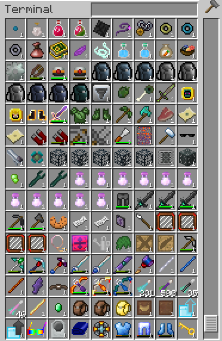
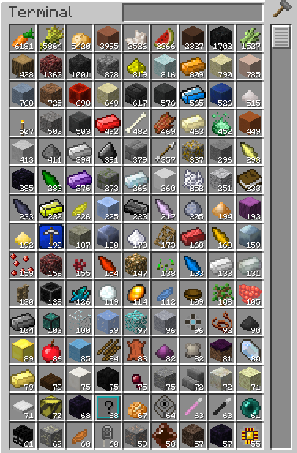

***************
Server Rules
***************

General Rules
#################

_______________

1 - Do not grief 

2 - Do not steal

3 - Do not Raid

4 - Do not cheat 

5 - Do not duplicate items

_______________

If you find a way to do one of the things listed above report it as soon as possible.

If not your character will go in jail for a period determined by 
PantACRO4life or the ►Staff◄  which will be  minimum of 48h maximum 14days.

If that happens again you will be punished.
If you cheat we will wipe all your progress and I swear, from build height to the bedrock you will loose everything, I promise!!!

_______________

6 - Be respectful

7 - Be ethical

8 - Use common sense

9 - Say hello!

10 - Be happy

11 - Play fair

12 - Don't spam the chat with annoying question like (how are we) 

13 - Don't ask my help everytime you see me connected. I know i'm the admin but there are the ►Staff◄

_______________

honeslty i'd like too play too and you can always send me a mail from 
the game "/mail send PantACRO4life (reason)"

_______________

14 - If you found something wrong, Bug, Glitch, Please Report it  `here <http://discord.gg/kX25QRD>`_

_______________

_______________

Quarry Rules
############

_______________

Quarry that swaps blocks is tolarated in any world at Max 100x100 area

Quarry that dig holes are only in Quarry World

For quarrying more than 100x100 area go in the Quarry World

_______________

_______________

Applied Energistics ME-System Rules
###################################

Applied Energistics is a complicate mod with many possibility. Storing your items into an ME-System is kind of fun but the server gets laggy if the **Rules aren't respected**...

**Never use your ME-System to store unstackable items like this**

    
Admin or staff will check in your system and warn your if that appears.

_________________________
    
**Your ME-System should look like this and with only Stackable Items!**    
    

    
_________________________

_________________________

